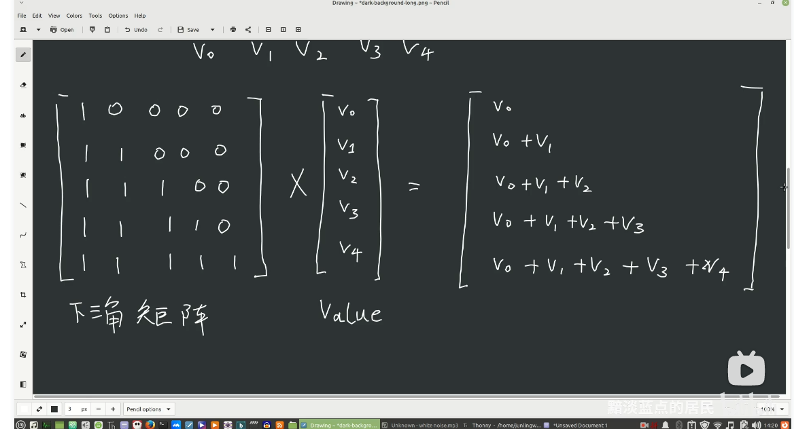
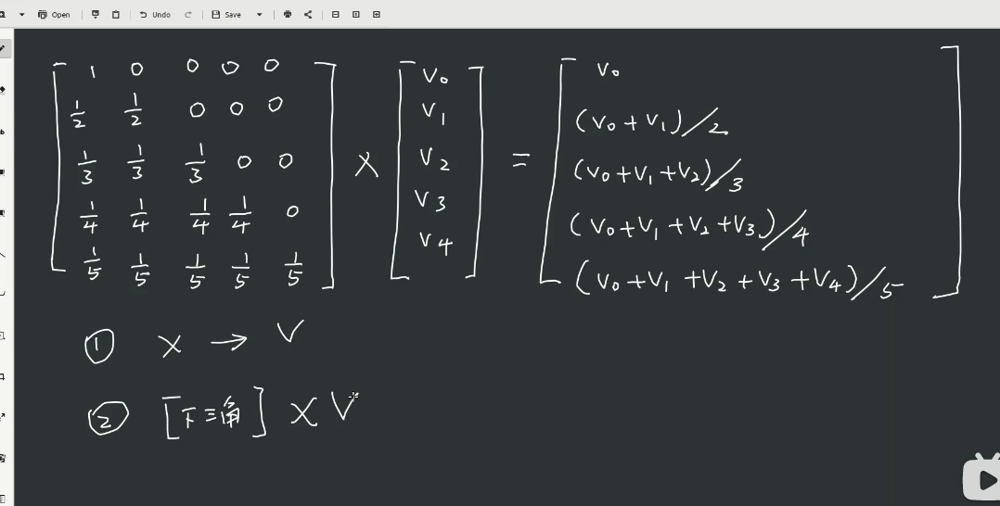
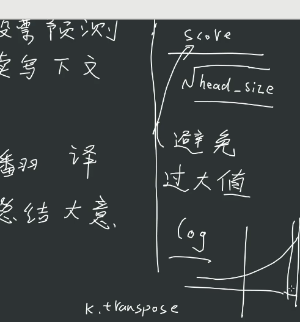

# Language Model Training and Text Generation

This project focuses on training a language model and generating text using **PyTorch**. The model utilizes a multi-layer Transformer network, combining self-attention mechanisms, feed-forward networks, and **residual connections**. This project allows for training on input text and generating text that is contextually relevant.

## Project Structure

- **Model Training**: Train the language model using large-scale text data and generate text based on the learned patterns.
- **Multi-Head Attention Mechanism**: In the Transformer model, multi-head attention is employed to capture complex relationships within the text.
- **Residual Connections**: Residual connections are used to improve the flow of information and gradients across the layers, helping in deeper architectures.
- **Text Generation**: After training the model, it generates text that aligns with the given input context.

## Technologies Used

### Frameworks and Libraries
- **PyTorch**: A deep learning framework used for building and training the neural network.
- **CUDA**: For accelerating training using GPU.

### Language
- **Python**: Implementation language for the model training and inference code.

## Features

- **Model Training**: Train a language model on the provided text data.
- **Text Generation**: After training, use the model to generate text based on a given context.
- **Batch Processing**: Supports large-scale data processing by training with batches.
- **Multi-Head Attention**: Enhances the model's ability to understand complex relationships in the text through multi-head attention.
- **Residual Connections**: Each Transformer block contains residual connections, allowing the model to skip certain layers, improving training stability and accuracy.

## Residual Connections

Residual connections, also known as skip connections, are an integral part of the Transformer model. They allow the input to skip certain layers and be added to the output of the same layers. This mechanism enables the model to learn residual mappings rather than direct mappings, helping in the case of deeper architectures. It facilitates better gradient flow, thereby improving training performance and reducing the likelihood of vanishing/exploding gradients.

In this project, residual connections are implemented in the `Block` class for both self-attention and feed-forward neural network layers.

Ensure you have the necessary dependencies installed:

```bash
pip install torch
```

# slides









